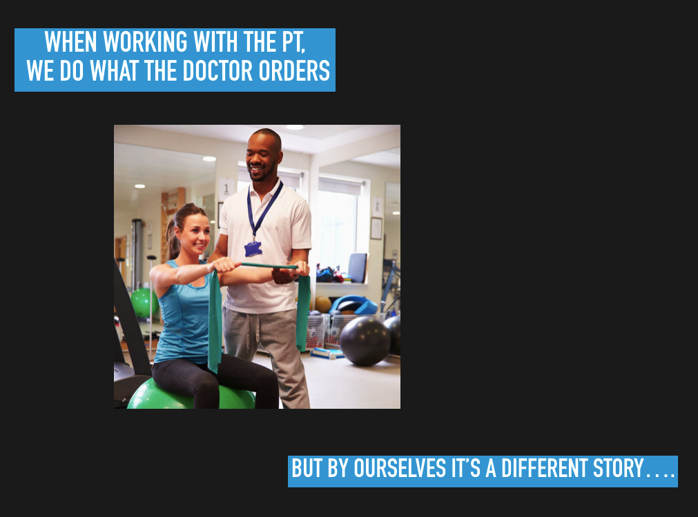
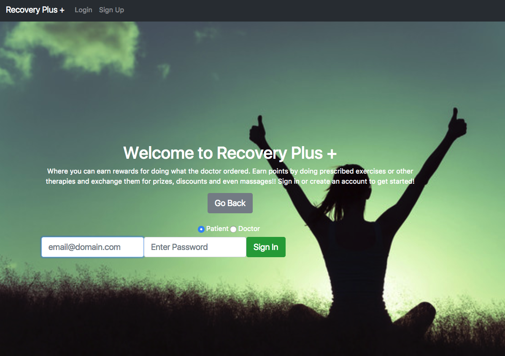
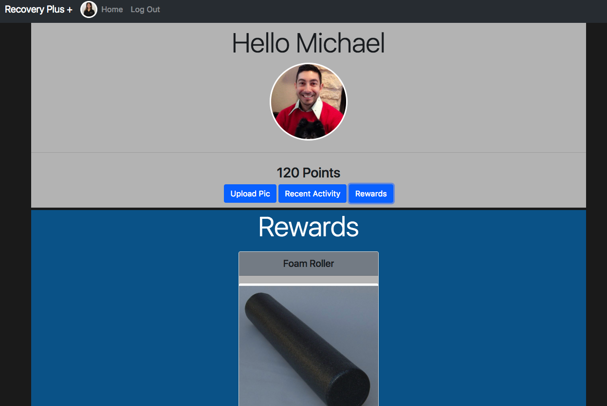
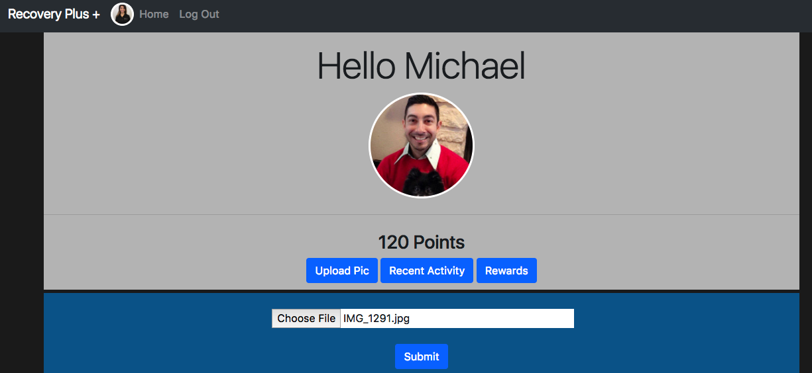
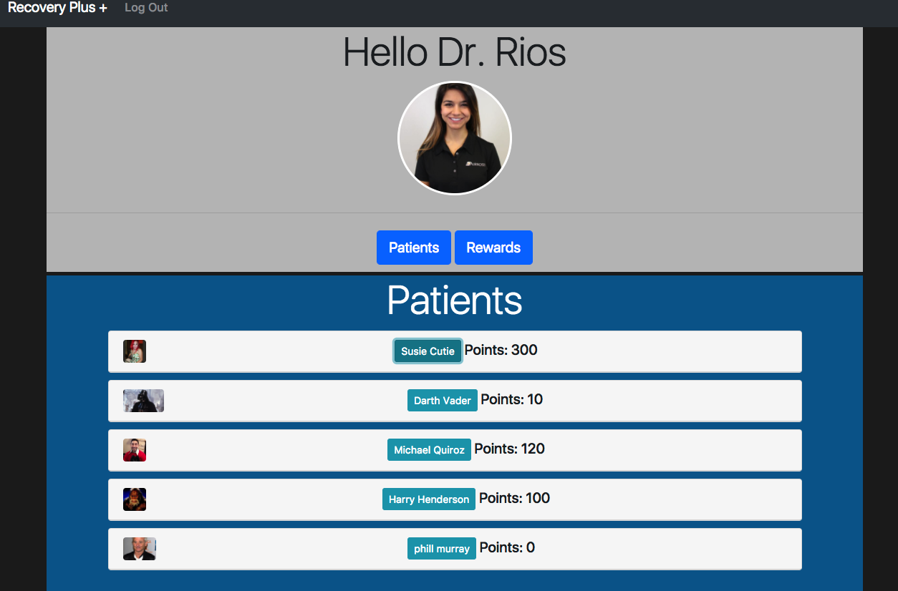
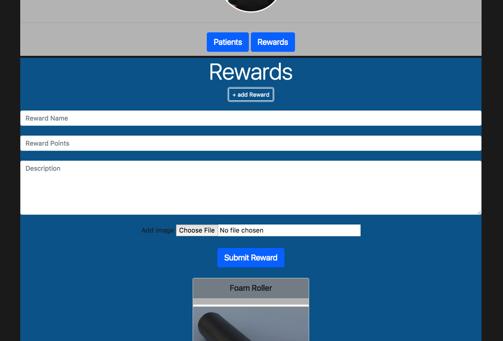

A web and mobile app to help incentivize patients in physical therapy to complete prescribed exercises.

Patients receive rewards for providing evidence of an exercise being completed. It is also a way for doctors to know if they are doing the exercises correctly. Doctors choose what kind of rewards they want to provide.  

## Tech Stack:

- Angular 1.6
- Node.js
- Express
- PostgreSQL
- Knex
- Bcrypt
- JSON Web Tokens
- Bootstrap 4 CSS
- Heroku (for deployment)
- Cloudinary (for image hosting)

---

[Demo Video](http://slides.com/cocomjolk/deck/live#/1)

[Link to Website](https://g63-capstone.herokuapp.com/#!/)
---

Heres the typical scenario

We've all been here

If only there was a way to show the doc we've been doing our exercises and be rewarded at the same time...not just in physical recovery.

## Walkthrough:
### 1. Sign In as patient
Users can sign in as a patient or doctor.

### 2. view rewards
Patients can view rewards the doctor has provided and redeem if they have enough points.

### 3. upload pic
Patients can upload pics of exercises.

### 4. As a doctor view patients
Doctors can view all patients and their posted activity.

### 5. add rewards
Doctors can add and remove rewards.

---
## Challenges:

- Keeping track of data flow, State management.
  Jumping back and forth between different files for authentication and verification and using ui router was convoluted at first. Became more clear after the paths were established.

- Token based authentication with multiple account types.
  Originally wanted just one, but decided to make two paths and routes for doctors and patients authentication. Mainly because they had their own tables.

- Custom file upload strategy.
  Used vanilla js to pass the uploaded file to the component controller and stored in local storage instead of passing file through angular. Needed a separate library to pass with angular directly. Will replace when refactoring.

---
## Future plans:

- Incorporate video upload.

- Add comments to uploads for patient and doctor to view.

- more doctor functionality to reject erroneous uploads.

- more editing capability for patient and doctors.

- Fb authentication

- REFACTORING

**Earn rewards on your road to recovery**
